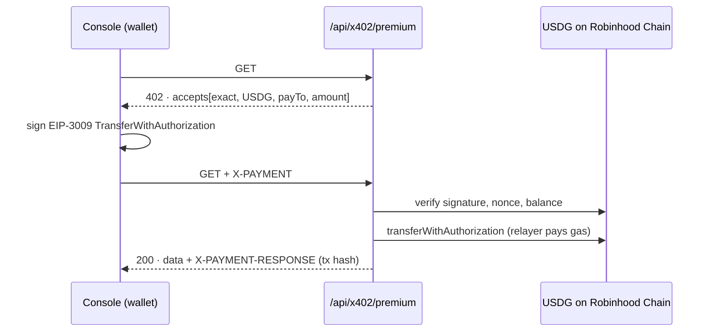

# Sherwood

[](https://github.com/sympony1992/sherwood/actions/workflows/ci.yml)


**Private agents. Zero knowledge.** Powered by ZKx8004.

Sherwood is a platform for deploying autonomous private agents with zero-knowledge proofs and x402 USDG payments on **[Robinhood Chain](https://docs.robinhood.com/chain)**, the EVM layer 2 built on Arbitrum Orbit. It runs on **ZKx8004**, the protocol behind the on-chain registry, the agent runtime and the x402 facilitator.

This repository contains the website, an interactive agent console, the `ZKx8004Registry` smart contract with its Foundry test suite and example integrations, a self-hosted x402 facilitator, and a Python SDK for agents.

## Two modes

| | **Live mode** | **Demo mode** |
| --- | --- | --- |
| Wallet | MetaMask, Rabby, Coinbase Wallet… (EIP-6963) | Local demo signer |
| Balances | Real ETH and USDG read from Robinhood Chain | Simulated (0.5 ETH, 1,000 USDG) |
| Payments | Real ETH/USDG transfers and EIP-3009 authorizations | Simulated with realistic fees |
| x402 | Real 402 → signature → facilitator settlement | Simulated flow |
| Registry | Deploy, anchor proofs, register agents, record executions on-chain | Simulated transactions |
| Network status | Live block height, gas price and RPC latency in both modes | ← same |

Every live transaction links to the Robinhood Chain explorer.

## Robinhood Chain details (verified on-chain)

| | Testnet | Mainnet (default) |
| --- | --- | --- |
| Chain ID | `46630` | `4663` |
| Gas token | ETH | ETH |
| USDG (Paxos Global Dollar, 6 decimals, EIP-3009) | `0x7E955252E15c84f5768B83c41a71F9eba181802F` | `0x5fc5360D0400a0Fd4f2af552ADD042D716F1d168` |
| EIP-712 domain | `Global Dollar` / `1` | `Global Dollar` / `1` |
| Explorer | [explorer.testnet.chain.robinhood.com](https://explorer.testnet.chain.robinhood.com) | [robinhoodchain.blockscout.com](https://robinhoodchain.blockscout.com) |
| RPC (in order) | publicnode → official → dRPC | publicnode → official → nodeflare |

Robinhood Chain has no USDC; x402 payments settle in **USDG**. `npm run chain:check` re-verifies all of the above.

> Some Indonesian ISPs block `*.robinhood.com` (including the official RPC and faucet). The app tries public RPCs first; use a VPN if a faucet will not open.

## Tech stack

- Next.js 16 (App Router, Turbopack) and React 19, TypeScript (strict)
- [viem](https://viem.sh) for Robinhood Chain, [solc](https://www.npmjs.com/package/solc) 0.8.37 for the registry contract
- Zod 4, Motion, Phosphor Icons, plain CSS with design tokens

## Getting started

Requires Node.js 20.9+.

```bash
npm install
cp .env.example .env.local   # optional, see below
npm run dev                  # http://localhost:3000
```

### Try it on testnet

1. Open the console and connect an EVM wallet. The app adds Robinhood Chain Testnet to the wallet.
2. Get testnet ETH from the [Chainlink](https://faucets.chain.link/robinhood-testnet) or [QuickNode](https://faucet.quicknode.com/robinhood/testnet) faucet, and USDG from the [Paxos faucet](https://faucet.paxos.com) if it offers Robinhood Chain.
3. **Blockchain tab** → *Deploy registry* (or set `NEXT_PUBLIC_REGISTRY_ADDRESS_TESTNET`).
4. **Privacy** → generate a proof → *Anchor*. **Agents** → deploy an agent (registered on-chain) → run *Contract interaction*.
5. **Payments** → send USDG with *x402 · EIP-3009*, or *Buy with x402* for the premium resource (needs a facilitator key).

### Mainnet end-to-end (x402 with real USDG)

```bash
npm run wallets:setup            # mainnet .env.local + facilitator and payer hot wallets (addresses only are printed)
npm run e2e:mainnet -- --check   # shows exactly how much ETH/USDG each wallet needs
npm run build && npm start       # app with the facilitator on http://localhost:3000
npm run e2e:mainnet -- --wait    # waits for funding, then runs everything
```

The run is verified on-chain step by step:

1. `GET /api/x402/premium` → 402 → EIP-3009 signature → facilitator settles → 200 with `X-PAYMENT-RESPONSE`, USDG `Transfer` event checked
2. Self-settled x402: the payer broadcasts `transferWithAuthorization`
3. Registry deployed (address saved to `.env.local` as `NEXT_PUBLIC_REGISTRY_ADDRESS_MAINNET`), proof anchored, agent registered, execution recorded, agent stopped. Each state change is read back at the transaction's block.

Typical cost at ~0.07 gwei: under 0.001 ETH for gas plus 0.02 USDG (sent to your own merchant wallet). Rebuild after the registry address is written so the console picks it up.

### Verified mainnet deployment

The full run above succeeded on Robinhood Chain mainnet (8/8 steps, ~0.0000736 ETH in total gas):

| Step | Transaction |
| --- | --- |
| x402 over HTTP, facilitator settlement (0.01 USDG) | [0xc2efe2…a946](https://robinhoodchain.blockscout.com/tx/0xc2efe21d21b71ff077fb5a34287514cba7d16ede24c1b9c9a4092f7c964ba946) |
| x402 self-settled authorization (0.01 USDG) | [0xa01625…7859](https://robinhoodchain.blockscout.com/tx/0xa01625407e6e955aa8daacfddc00f4ed1f2dec81668bff95c62403be97a57859) |
| ZKx8004Registry deployed | [0xf27669…3f12](https://robinhoodchain.blockscout.com/tx/0xf276696d95b88dd7e51ec4e48c93e9708cdb79864dc26f20ec741a75326b3f12) |
| Proof anchored | [0x545f67…9128](https://robinhoodchain.blockscout.com/tx/0x545f672ba1b3a016b013f04a538fab19677d44aacaa30a8ab338f95cbc0e9128) |
| Agent registered | [0x68ca72…0428](https://robinhoodchain.blockscout.com/tx/0x68ca72810bd868485b0d43d38b748625650986e143a33686da265d99ea230428) |
| Execution recorded | [0xf11600…7dc4](https://robinhoodchain.blockscout.com/tx/0xf11600220f9c7771c57ddf72325c40fbbc674f6efc864b18d939d667a3f37dc4) |
| Agent stopped | [0xa253c3…d3cf](https://robinhoodchain.blockscout.com/tx/0xa253c3c8160e052ca90e7c5f4ee75236c02d60ee0079c23e022d61b459bed3cf) |

Registry: [`0x3c72695fdd4bf09ab378d993832e6d15d628291f`](https://robinhoodchain.blockscout.com/address/0x3c72695fdd4bf09ab378d993832e6d15d628291f). Re-check any time with `npm run chain:receipts -- <txHash> --code <address>`.

## Deployments: mainnet and testnet subdomain

The network is inlined at build time, so mainnet and testnet are two deployments of the same repository and branch. Pushing to `main` updates both.

| | Mainnet (main domain) | Testnet (subdomain) |
| --- | --- | --- |
| Example URL | `https://sherwood.example` | `https://testnet.sherwood.example` |
| `NEXT_PUBLIC_ROBINHOOD_NETWORK` | `mainnet` | `testnet` |
| `NEXT_PUBLIC_SITE_URL` | main domain | testnet subdomain |
| `NEXT_PUBLIC_MAINNET_URL` / `NEXT_PUBLIC_TESTNET_URL` | both URLs | both URLs |
| `NEXT_PUBLIC_REGISTRY_ADDRESS_*` | `_MAINNET` | `_TESTNET` (optional) |
| `X402_FACILITATOR_PRIVATE_KEY` | mainnet relayer | **separate** testnet relayer |
| Search engines | indexed | `noindex` (automatic) |

What changes automatically in a testnet build: an amber "Robinhood Chain testnet · test funds only" status, a "Try it on testnet" section with faucet links instead of the mainnet facts, the tab title "Sherwood Testnet", and `noindex` metadata. Both sites link to each other once both URLs are set.

**Vercel setup**

1. Keep the existing project as mainnet.
2. *Add New → Project* → import the same GitHub repository again, named for example `sherwood-testnet`.
3. In the testnet project, set the variables from the table above for *Production*, then deploy.
4. *Settings → Domains* → add `testnet.<your-domain>`.
5. At your DNS provider, add `CNAME testnet → cname.vercel-dns.com` (Vercel shows the exact record).
6. In **both** projects, set `NEXT_PUBLIC_MAINNET_URL` and `NEXT_PUBLIC_TESTNET_URL`, then redeploy so the switch links appear.

**Local testnet build**

```bash
# bash
NEXT_PUBLIC_ROBINHOOD_NETWORK=testnet npm run build && npm start -- -p 3200
```

```powershell
# PowerShell
$env:NEXT_PUBLIC_ROBINHOOD_NETWORK = "testnet"; npm run build; npm start -- -p 3200
```

`npm run e2e:testnet` runs the on-chain end-to-end flow on testnet (it writes `NEXT_PUBLIC_REGISTRY_ADDRESS_TESTNET` to `.env.local`). Pass `--testnet` to other scripts, for example `npm run chain:receipts -- <hash> --testnet`.

## Environment variables

| Variable | Scope | Purpose |
| --- | --- | --- |
| `NEXT_PUBLIC_ROBINHOOD_NETWORK` | public | `mainnet` (default, real funds) or `testnet`; rebuild after changing |
| `E2E_PAYER_PRIVATE_KEY` | scripts | Hot wallet used by `npm run e2e:mainnet` |
| `BASE_URL` | scripts | App URL for the x402 HTTP step (default `http://localhost:3000`) |
| `NEXT_PUBLIC_REGISTRY_ADDRESS_TESTNET` / `_MAINNET` | public | Pre-deployed registry addresses |
| `NEXT_PUBLIC_TREASURY_ADDRESS` | public | Receives protocol fees in live mode; fees are skipped when empty |
| `NEXT_PUBLIC_SITE_URL` | public | Open Graph base URL |
| `NEXT_PUBLIC_MAINNET_URL` / `NEXT_PUBLIC_TESTNET_URL` | public | Sibling deployment URLs for the Mainnet ↔ Testnet switch (hidden while empty) |
| `X402_FACILITATOR_PRIVATE_KEY` | **server** | Relayer that settles `transferWithAuthorization` and pays gas |
| `X402_PAY_TO` | server | Merchant address for x402 payments (defaults to the relayer) |
| `X402_PRICE_USDG` | server | Price of `/api/x402/premium` (default `0.01`) |

## x402 on Robinhood Chain



| Route | Description |
| --- | --- |
| `GET /api/x402/premium` | Paid resource: 402 challenge, then verify + settle |
| `POST /api/x402/verify` | Facilitator verification (`paymentPayload`, `paymentRequirements`) |
| `POST /api/x402/settle` | Facilitator settlement |
| `GET /api/x402/supported` | Network, asset, price and whether a facilitator key is configured |

Security notes:

- The relayer only settles payments whose `payTo` equals the configured merchant, so it cannot be used as an open gas faucet.
- Fund the relayer with a little ETH only; it never holds USDG. Keep its key in server environment variables, never in the repo.
- Add rate limiting in front of `/api/x402/*` before production.
- Without a facilitator key, x402 payments in the console are settled by the payer's own wallet.

## ZKx8004Registry contract

[`contracts/ZKx8004Registry.sol`](contracts/ZKx8004Registry.sol) stores only commitments and hashes:

- `anchorProof(bytes32 commitment, bytes32 nullifier, string circuit)`: one-time anchors with nullifier protection
- `registerAgent(bytes32 agentId, bytes32 configCommitment)` / `setAgentActive`
- `recordExecution(bytes32 agentId, bytes32 capability, bytes32 resultHash)`
- `getAnchor`, `getAgent`, `nullifierUsed`

Compiled with solc 0.8.37, `evmVersion: cancun` (PUSH0, MCOPY and TSTORE were verified on Robinhood Chain). After editing the contract run `npm run contracts:compile`.

### Foundry workspace

`foundry.toml` uses the same compiler settings, so Foundry builds the bytecode the app deploys. The registry source is excluded from `forge fmt`: reformatting would change its metadata hash and break explorer verification.

```bash
git submodule update --init          # forge-std
forge build --sizes
forge test                           # unit, fuzz and invariant tests
FOUNDRY_PROFILE=ci forge test        # more fuzz runs, as in CI
```

| Path | Contents |
| --- | --- |
| `contracts/interfaces/IZKx8004Registry.sol` | Integration interface, kept selector-compatible with the registry by `test/RegistryInterface.t.sol` |
| `contracts/interfaces/IERC3009.sol` | The USDG EIP-3009 subset x402 relies on |
| `contracts/examples/AgentGate.sol` | Base contract: only agents registered and active in the registry may call |
| `contracts/examples/AgentSignalBoard.sol` | Agents publish signal commitments per topic before selling the signal over x402 |
| `contracts/examples/X402Settler.sol` | On-chain x402 settlement relay that can only pay the configured merchant |
| `test/` | Registry unit, fuzz and invariant tests, example contract tests, cross-language vector tests, `MockUSDG` |
| `script/` | `DeployRegistry`, `DeployAgentSignalBoard`, `DeployX402Settler` |

Deploy with `forge script script/DeployRegistry.s.sol --rpc-url <rpc> --broadcast --interactive`, then set `NEXT_PUBLIC_REGISTRY_ADDRESS_*`.

## Python SDK

[`sdk/python`](sdk/python) lets Python agents pay x402 resources and use the registry:

```python
from eth_account import Account
from sherwood import TESTNET, X402Client

with X402Client(Account.from_key(key), network=TESTNET, max_amount="0.05") as client:
    result = client.get("https://your-sherwood-host/api/x402/premium")
```

It also reads and writes the registry, decodes its custom errors and events, derives agent ids and commitments exactly like the console, and ships a `sherwood` CLI. Tests cover unit behaviour, a local anvil node (registry lifecycle and an on-chain settlement of a Python-signed payment) and parity with the TypeScript verifier. See the [SDK README](sdk/python/README.md).

## Cross-language test vectors

`npm run vectors` hashes, commits and signs fixed inputs with the app's own TypeScript code and writes [`test/vectors/x402-vectors.json`](test/vectors/x402-vectors.json). Foundry (`test/X402Vectors.t.sol`) and the Python SDK (`sdk/python/tests/test_vectors.py`) must reproduce every value, down to the EIP-712 digest, the signature and the `X-PAYMENT` header bytes. CI runs `npm run vectors:check` so the file cannot go stale.

## Scripts

| Script | Purpose |
| --- | --- |
| `npm run dev` / `build` / `start` | Development, production build, serve |
| `npm run lint` / `typecheck` | ESLint and TypeScript |
| `npm test` | Runtime end-to-end checks (demo mode) and x402 checks, including an on-chain signature check on testnet |
| `npm run chain:check` | Live read-only checks of RPCs, USDG and the EIP-712 domain |
| `npm run chain:receipts` | Re-check transactions (status, fees, USDG transfers) and contract code on the active network |
| `npm run test:server` | HTTP checks of `/api/x402/*` against a running app (no funds needed) |
| `npm run wallets:setup` | Create mainnet `.env.local` with facilitator and payer hot wallets |
| `npm run e2e:mainnet` | Real on-chain run: x402 HTTP + self-settled, registry, anchor, agent lifecycle (`--check`, `--wait`) |
| `npm run contracts:compile` | Compile the registry into `src/lib/chain/registry-artifact.ts` |
| `npm run contracts:test` | Foundry unit, fuzz and invariant tests (`forge test`) |
| `npm run vectors` / `vectors:check` | Regenerate or verify the cross-language test vectors |
| `npm run sdk:test` | Python SDK tests (unit, anvil integration, TypeScript parity) |

## Project structure

```
contracts/
├── ZKx8004Registry.sol           # registry contract (deployed on mainnet)
├── interfaces/                   # IZKx8004Registry, IERC3009
└── examples/                     # AgentGate, AgentSignalBoard, X402Settler
test/                             # Foundry tests, MockUSDG, cross-language vectors
script/                           # Foundry deployment scripts
sdk/python/                       # Python SDK, CLI, examples and tests
scripts/                          # compile, chain checks, runtime and x402 tests, vector generator
src/
├── app/
│   ├── api/x402/                 # premium, verify, settle, supported
│   └── layout, page, icon, error, not-found
├── components/                   # landing sections, console panels, UI primitives
├── content/                      # copy and terminal script
├── lib/
│   ├── chain/                    # config, ABI, viem clients, wallets, x402, facilitator, artifact
│   └── runtime/                  # contexts (wallet, privacy, payment, blockchain, agents), actions, memory
└── styles/
```

## What is real, and what is not

- **Real:** EVM wallet connection, ETH/USDG balances and transfers, EIP-3009 signatures verified against the USDG contract, facilitator settlement, registry deployment and writes, schema validation, SHA-256 commitments, AES-GCM vault, persistence.
- **Simulated:** everything in demo mode, and agent command outputs such as trading PnL or MPC results (their on-chain records are real in live mode).
- Proofs are hash commitments over sealed inputs, not zk-SNARKs. They detect tampering and can be anchored on-chain, but they are not succinct zero-knowledge proofs.

## Roadmap

- [x] Website, console and composable runtime
- [x] Robinhood Chain: live wallets, USDG x402, registry contract
- [x] Foundry test suite, example integrations and a Python SDK with cross-language vectors
- [ ] zk-SNARK circuits and an on-chain verifier
- [ ] Contract verification on Blockscout and a mainnet registry
- [ ] Rate-limited hosted facilitator

## Links

- Robinhood Chain docs: [docs.robinhood.com/chain](https://docs.robinhood.com/chain)

## License

MIT
